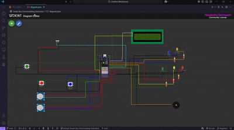

# 🚌 SBOD - Smart Bus Overcrowding Detection System

<div align="center">
  
  
  <h3>IoT-based Real-time Bus Passenger Monitoring Solution</h3>
  
  [](https://sbod.tiiny.site)
  [](LICENSE)
  [](https://www.espressif.com/en/products/socs/esp32)
  [](https://wokwi.com)
  []()
  [](https://sbod.tiiny.site)
</div>

---

## 📺 Demo & Presentation

<div align="center">
  
  ### System Running Demo

  <!-- GIF preview with download link for video -->
  <div align="center">
    
    <br/>
    <strong>▶ Watch Full Demo Video</strong>
    <br/>
    <a href="https://raw.githubusercontent.com/HMAHD/Smart-Bus-Overcrowding-Detection/main/Data/assets/Smart%20Bus%20Overcrowding%20Detection.mp4">Download video</a>
  </div>
  <!--
  If you do not have a YouTube video, replace VIDEO_ID with your actual video ID or keep the previous image+link fallback.
  -->

  <br/>
  <em>*Watch the SBOD system in action*</em>

</div>

---

## 🎯 Project Overview

SBOD (Smart Bus Overcrowding Detection) is an innovative IoT solution designed to address the critical challenge of bus overcrowding in Sri Lankan public transportation. The system provides real-time passenger counting, automated alerts, and comprehensive analytics to improve service efficiency and passenger experience.

### Key Features

- 🔢 **Dual-Sensor Passenger Counting** - IR sensors + Camera validation
- 📊 **Real-time Monitoring** - Live dashboard for transport authorities
- 🚨 **Automated Alerts** - Instant overcrowding notifications
- 📍 **GPS Tracking** - Location-based passenger density analysis
- 📈 **Predictive Analytics** - Data-driven insights for better scheduling
- 🎮 **Driver Interface** - LED alerts and LCD display for immediate action

---

## 👥 User Guide (For Visitors)

### What is SBOD?

SBOD is a smart system that helps manage bus crowding in real-time. It counts passengers automatically and alerts authorities when buses become too crowded, helping improve public transport services.

### How It Works

1. **Sensors Count Passengers**
   - Infrared sensors at doors count people entering/exiting
   - Overhead camera validates the count for accuracy
2. **Smart Processing**
   - An onboard computer (ESP32) processes sensor data
   - Combines both sensor readings for accurate counting
3. **Real-time Alerts**
   - 🟢 Green Light: Plenty of space (less than 60% full)
   - 🟡 Yellow Light: Getting crowded (60-80% full)
   - 🔴 Red Light: Overcrowded (more than 80% full)
4. **Dashboard Monitoring**
   - Transport authorities see all buses on a live map
   - Instant alerts when buses are overcrowded
   - Historical data helps improve routes

### Benefits for Passengers

- ✅ Reduced waiting times
- ✅ Better distributed passenger loads
- ✅ Improved journey comfort
- ✅ Real-time bus capacity information (future mobile app)

### Benefits for Transport Authorities

- ✅ Data-driven decision making
- ✅ Optimize bus deployment
- ✅ Identify problem routes/times
- ✅ Improve overall service quality

### Live Demo

Visit our [**Live Dashboard**](https://sbod.tiiny.site) to see:

- Real-time bus locations and occupancy
- Historical crowding patterns
- Route analytics and insights

---

## 🛠️ Developer Guide

### System Architecture

```
┌─────────────────┐     ┌──────────────┐     ┌─────────────────┐
│   Bus Sensors   │────▶│    ESP32     │────▶│   4G Network    │
│ • IR Sensors    │     │ • Processing │     │ • MQTT Protocol │
│ • Camera        │     │ • Fusion     │     │ • JSON Data     │
│ • GPS Module    │     │ • Local UI   │     │                 │
└─────────────────┘     └──────────────┘     └────────┬────────┘
                                                       │
                        ┌──────────────┐     ┌─────────▼────────┐
                        │ NTC Dashboard│◀────│  Cloud Server    │
                        │ • Live Map   │     │ • Data Storage   │
                        │ • Analytics  │     │ • Processing     │
                        │ • Alerts     │     │ • API Services   │
                        └──────────────┘     └──────────────────┘
```

### Prerequisites

- **Hardware** (for physical implementation):
  - ESP32 Development Board
  - IR Break-beam Sensors (2x)
  - USB Camera Module
  - GPS Module (NEO-6M)
  - 16x2 LCD Display (I2C)
  - LEDs (Red, Yellow, Green) and Buzzer
- **Software**:
  - Arduino IDE (v1.8.19 or later)
  - Python 3.8+ (for data analysis)
  - Node.js (for dashboard)
  - Wokwi Account (for simulation)

### 🚀 Quick Start

#### 1. Clone the Repository

```bash
git clone https://github.com/HMAHD/Smart-Bus-Overcrowding-Detection.git
cd Smart-Bus-Overcrowding-Detection
```

#### 2. Project Structure

```
SBOD/
├── Arduino/
│   └── SBOD_Main/
│       └── SBOD_Main.ino      # Main ESP32 code
├── Dashboard/
│   ├── index.html             # NTC Dashboard
│   ├── css/
│   └── js/
├── Data/
│   ├── bus_overcrowding_data.csv
│   ├── KPI/                   # Performance visualizations
│   └── Visuals/               # System diagrams
├── Scripts/
│   ├── bus_data_generator.py  # Generate simulation data
│   ├── evaluation_insights.py # Analysis scripts
│   └── kpi_visualizations.py  # Create charts
├── Simulation/
│   └── wokwi_config.json      # Wokwi simulation setup
└── Documentation/
    └── *.docx                 # Full project report
```

#### 3. Running the Wokwi Simulation

1. Open [Wokwi.com](https://wokwi.com)
2. Create a new ESP32 project
3. Copy the contents from `Simulation/wokwi_config.json`
4. Upload the code from `Arduino/SBOD_Main/SBOD_Main.ino`
5. Click "Start Simulation"

**Simulation Controls:**

- 🟢 Green Button: Simulate passenger entry
- 🔴 Red Button: Simulate passenger exit
- 🔵 Blue Button: Trigger camera count
- 🎚️ Potentiometers: Adjust passenger flow and camera accuracy

#### 4. Setting Up the Dashboard

```bash
cd Dashboard
# If using Python simple server
python -m http.server 8000
# Or using Node.js
npx http-server -p 8000
```

Visit `http://localhost:8000` to view the dashboard locally.

#### 5. Data Generation and Analysis

Generate simulation data:

```bash
cd Scripts
python bus_data_generator.py
```

Create visualizations:

```bash
python kpi_visualizations.py
```

Generate insights:

```bash
python evaluation_insights.py
```

### 📡 API Endpoints (Conceptual)

```javascript
// Real-time bus data
GET /api/buses
Response: {
  "buses": [{
    "id": "BUS-138-CMB",
    "location": {...},
    "passengers": 43,
    "status": "OVERCROWDED"
  }]
}

// Historical data
GET /api/analytics/route/138
Response: {
  "peakHours": ["07:00-09:00", "17:00-19:00"],
  "avgOccupancy": 78.9,
  "criticalStops": ["Pettah", "Maradana"]
}

// Alert notification
POST /api/alerts
Body: {
  "busId": "BUS-138-CMB",
  "type": "OVERCROWDING",
  "location": "Pettah",
  "severity": "HIGH"
}
```

### 🔧 Configuration

#### ESP32 Configuration (Arduino/SBOD_Main/config.h)

```cpp
// WiFi Settings
const char* WIFI_SSID = "your_wifi_ssid";
const char* WIFI_PASSWORD = "your_password";

// MQTT Settings
const char* MQTT_SERVER = "broker.hivemq.com";
const int MQTT_PORT = 1883;
const char* MQTT_TOPIC = "sbod/bus/138";

// Sensor Pins
const int IR_ENTRY_PIN = 2;
const int IR_EXIT_PIN = 15;
const int CAMERA_PIN = 4;

// Thresholds
const int MAX_CAPACITY = 50;
const float OVERCROWD_THRESHOLD = 0.8;
```

### 🧪 Testing

Run the test suite:

```bash
cd Scripts
python test_sbod_system.py
```

Test scenarios include:

- Normal passenger flow
- Overcrowding detection
- Sensor fusion accuracy
- Network failure handling
- Edge cases (full bus, empty bus)

### 📊 Data Formats

#### Sensor Data (JSON)

```json
{
  "timestamp": "2024-01-15T08:15:30Z",
  "bus_id": "BUS-138-CMB",
  "sensors": {
    "ir_count": 42,
    "camera_count": 44,
    "validated_count": 43
  },
  "location": {
    "stop": "Pettah",
    "coordinates": [6.9356, 79.8487]
  },
  "status": {
    "occupancy_percent": 86.0,
    "alert_level": "OVERCROWDED"
  }
}
```

---

## 📁 Data & Analytics

All generated data and visualizations are available in the `Data/` folder:

- **Raw Data**: `bus_overcrowding_data.csv` - 216 data points from simulation
- **KPI Charts**: `Data/KPI/` - 9 comprehensive visualizations
- **System Diagrams**: `Data/Visuals/` - Architecture and flow diagrams

---

## 🤝 Contributing

We welcome contributions! Please see our [Contributing Guidelines](CONTRIBUTING.md) for details.

1. Fork the repository
2. Create your feature branch (`git checkout -b feature/AmazingFeature`)
3. Commit your changes (`git commit -m 'Add some AmazingFeature'`)
4. Push to the branch (`git push origin feature/AmazingFeature`)
5. Open a Pull Request

---

## 📄 License

This project is licensed under the MIT License - see the [LICENSE](LICENSE) file for details.

---

## 👨‍💻 Team

- **Akash** - Evaluation & Data Analysis
- **Bhagya** - Proposed Design/Solution & Executive Summary
- **Yasas** - Project Lead, Executive Summary & Conclusion
- **Piyumi** - Introduction & Project Overview
- **Ruwi** - Literature & Technology Review
- **Nilupul** - Requirements & Objectives Analysis
- **Amesha** - Discussion & Implementation Analysis

### Team Contributions

| Member  | Primary Responsibility | Key Contributions                                                |
| ------- | ---------------------- | ---------------------------------------------------------------- |
| Akash   | Evaluation             | KPI analysis, sensor accuracy testing, data visualization        |
| Bhagya  | System Design          | Architecture design, component integration, solution development |
| Yasas   | Project Management     | Executive summary, conclusions, overall coordination             |
| Piyumi  | Documentation          | Project introduction, background research                        |
| Ruwi    | Research               | Technology review, IoT standards analysis                        |
| Nilupul | Requirements           | Functional/non-functional requirements specification             |
| Amesha  | Analysis               | Security considerations, limitations, operational implications   |

---

## 📞 Contact & Support

- **Project Website**: [https://sbod.tiiny.site](https://sbod.tiiny.site)
- **Issues**: [GitHub Issues](https://github.com/HMAHD/Smart-Bus-Overcrowding-Detection/issues)

---

## 🙏 Acknowledgments

- NSBM Green University - Faculty of Computing
- National Transport Commission of Sri Lanka
- Course Instructors: Isuru Sri Bandara & Chamindra Attanayake

---

<div align="center">
  <strong>Making Public Transport Smarter, One Bus at a Time! 🚌</strong>
  
  ⭐ Star us on GitHub — it helps!
</div>
